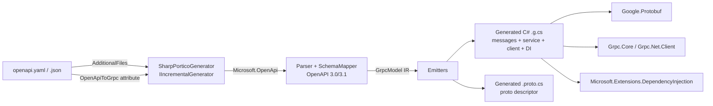

# SharpPortico

**Incremental Source Generator: OpenAPI 3.0/3.1 → gRPC + Protobuf + C# 14**

SharpPortico is a compile-time source generator that converts OpenAPI specifications (YAML or JSON) into production-quality gRPC services, protobuf messages, and modern C# 14 client/server code — zero reflection, NativeAOT-safe, fully AOT compatible.


## Highlights

- 🚀 **`IIncrementalGenerator`** — fast incremental pipeline, safe on 10k-line specs
- 📦 **C# 14** output — primary constructors, collection expressions, required members, file-scoped namespaces
- 🧱 **NativeAOT / reflection-free** — hand-written `IMessage<T>` implementations, no `Activator`
- 🌐 **Both server and client** — `ServiceBase` (server) + modern typed client (`GrpcChannel`)
- 🔐 **Auth mapped** — Bearer / API-Key / OAuth2 metadata helpers and interceptors
- 🧠 **Smart mapping** — `$ref`, `allOf`, `oneOf`/`anyOf`, arrays → `repeated`, enums, pagination detection, streaming hints (`x-grpc-streaming`), octet-stream → `bytes`
- 🛠️ **Two declaration styles** — `<AdditionalFiles>` and/or `[OpenApiToGrpc]` assembly attributes

## Architecture



## Mapping rules

| OpenAPI Concept | gRPC / Protobuf Mapping |
| --- | --- |
| paths + HTTP verb | Unary RPC by default; `x-grpc-streaming: client\|server\|bidi` or large POST payloads → streaming |
| path / query / header params | Combined into a single `*Request` message |
| request body | Nested message; `application/octet-stream` → `bytes` + content_type |
| response | `*Response` message + google.rpc.Status-shaped error wrapper |
| components/schemas | `message` definitions; `$ref`, `allOf`, `oneOf`/`anyOf` resolved |
| arrays | `repeated` fields |
| enums | protobuf enums |
| authentication | metadata helpers + interceptors for Bearer / API-Key / OAuth2 |
| pagination | `page/limit/cursor/next_page_token` detected → token-based or server-streaming |

## Quick start

### 1. Declare the spec

**`OpenApiToGrpc` attribute** (assembly level):

```csharp
using SharpPortico;

[assembly: OpenApiToGrpc("openapi/users.yaml", "UserService", "MyApp.Generated")]
```

**or MSBuild `<AdditionalFiles>`:**

```xml
<ItemGroup>
  <AdditionalFiles Include="openapi/**/*.yaml" />
</ItemGroup>
```

### 2. Reference the generator

```xml
<ProjectReference Include="../../src/SharpPortico.SourceGenerator/SharpPortico.SourceGenerator.csproj"
                  ReferenceOutputAssembly="false"
                  OutputItemType="Analyzer" />
```

### 3. Use the generated code

```csharp
using var channel = GrpcChannel.ForAddress("http://localhost:50051");
var client = UserServiceClient.Create(channel);

var user = await client.GetUserAsync(42);
```

## Repo layout

```
SharpPortico/
├── src/
│   ├── SharpPortico.SourceGenerator/   // Incremental generator
│   ├── SharpPortico.Abstractions/      // [OpenApiToGrpc] attribute + options
│   ├── SharpPortico.Runtime/           // AOT-safe runtime helpers (packed)
│   └── SharpPortico.Cli/               // dotnet sharpportico generate (tool)
├── samples/
│   ├── GrpcServerExample/              // full gRPC server + client (petstore)
│   └── MinimalApiExample/              // ASP.NET Minimal API over the gRPC client
├── tests/
│   └── SharpPortico.Tests/             // xunit snapshot + mapping + perf tests
└── docs/
```

## CLI

```bash
dotnet run --project src/SharpPortico.Cli -- generate openapi/petstore.yaml --out out/
```

## License

MIT — see [LICENSE](LICENSE). Copyright (c) 2026 MPCoreDeveloper.