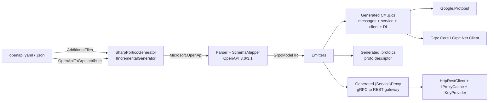

# SharpPortico

**Incremental Source Generator: OpenAPI 3.0/3.1 → gRPC + Protobuf + C# 14**

SharpPortico is a compile-time source generator that converts OpenAPI specifications (YAML or JSON) into production-quality gRPC services, protobuf messages, and modern C# 14 client/server code — zero reflection, NativeAOT-safe, fully AOT compatible. An optional **proxy mode** turns it into a gRPC↔REST gateway for legacy REST APIs.


## Highlights

- 🚀 **`IIncrementalGenerator`** — fast incremental pipeline, safe on 10k-line specs
- 📦 **C# 14** output — primary constructors, collection expressions, required members, file-scoped namespaces
- 🧱 **NativeAOT / reflection-free** — hand-written `IMessage<T>` implementations, no `Activator`
- 🌐 **Both server and client** — `ServiceBase` (server) + modern typed client (`GrpcChannel`)
- 🔁 **Proxy mode** — generated `{Service}Proxy : ServiceBase` forwards gRPC → legacy REST (X-Api-Key outbound, response cache with per-call bypass, ULID client keys, audit logging)
- 🔐 **Auth mapped** — Bearer / API-Key / OAuth2 metadata helpers and interceptors
- 🧠 **Smart mapping** — `$ref`, `allOf`, `oneOf`/`anyOf`, arrays → `repeated`, enums, pagination detection, streaming hints (`x-grpc-streaming`), octet-stream → `bytes`
- 🛠️ **Two declaration styles** — `<AdditionalFiles>` and/or `[OpenApiToGrpc]` assembly attributes

## Architecture



## Mapping rules

| OpenAPI Concept | gRPC / Protobuf Mapping |
| --- | --- |
| paths + HTTP verb | Unary RPC by default; `x-grpc-streaming` or large POST payloads → streaming |
| path / query / header params | Combined into a single `*Request` message |
| request body | Nested message; `application/octet-stream` → `bytes` |
| response | `*Response` message + google.rpc.Status-shaped error wrapper |
| components/schemas | `message` definitions; `$ref`, `allOf`, `oneOf`/`anyOf` resolved |
| arrays | `repeated` fields |
| enums | protobuf enums |
| authentication | metadata helpers + interceptors for Bearer / API-Key / OAuth2 |
| pagination | `page/limit/cursor/next_page_token` detected → token-based or server-streaming |

## Quick start

### 1. Declare the spec

**`OpenApiToGrpc` attribute** (assembly level):

```csharp
using SharpPortico;

[assembly: OpenApiToGrpc("openapi/users.yaml", "UserService", "MyApp.Generated")]
```

**or MSBuild `<AdditionalFiles>`:**

```xml
<ItemGroup>
  <AdditionalFiles Include="openapi/**/*.yaml" />
</ItemGroup>
```

### 2. Reference the generator

```xml
<ProjectReference Include="../../src/SharpPortico.SourceGenerator/SharpPortico.SourceGenerator.csproj"
                  ReferenceOutputAssembly="false"
                  OutputItemType="Analyzer" />
```

### 3. Use the generated code

```csharp
using var channel = GrpcChannel.ForAddress("http://localhost:50051");
var client = UserServiceClient.Create(channel);

var user = await client.GetUserAsync(42);
```

## Proxy mode (gRPC clients → legacy REST)

Point local .NET apps at SharpPortico over gRPC while it forwards to a legacy REST service (X-Api-Key, corporate network). Host the generated `{Service}Proxy : ServiceBase`:

```csharp
[assembly: OpenApiToGrpc("openapi/users.yaml", "UserService", "MyApp.Generated",
    EnableProxyGeneration = true,
    ProxyBaseUrl = "https://corporate.example",
    ProxyApiKeyHeaderName = "X-Api-Key",
    ProxyCacheTtlSeconds = 60,
    ProxyClientKeyMode = ClientKeyMode.None,
    ProxyAuditEnabled = true)]
```

```csharp
var options = new ProxyOptions { BaseUrl = "https://corporate.example", ApiKeyHeaderName = "X-Api-Key" };
server.Services.Add(UserService.BindService(
    new UserServiceProxy(options, new HttpRestClient(httpClient, options.BaseUrl),
        cache: new MemoryProxyCache(memoryCache), keys: keyProvider)));
```

- **Cache**: GET responses are cached (TTL). Clients bypass per call via `x-portico-bypass-cache` metadata.
- **Client keys** (`ProxyClientKeyMode`): `None` · `Forward` (client key → X-Api-Key 1:1) · `Own` (validate ULID-shaped key `x-portico-key`, use configured outbound key).
- **Keys never hardcoded**: `IKeyProvider` (config / Key Vault / delegate).
- **Audit**: `ProxyAuditEnabled = true` (or inject `IProxyAuditLogger`) logs client, RPC, cache-hit, HTTP status.

Live end-to-end demo: `samples/LegacyProxyExample`. Full developer guide: `docs/SharpPortico.md`. NuGet package readmes: `src/SharpPortico.SourceGenerator/README.md`, `src/SharpPortico.Runtime/README.md`, `src/SharpPortico.Cli/README.md`.

## Repo layout

```
SharpPortico/
├── src/
│   ├── SharpPortico.SourceGenerator/   // Incremental generator
│   ├── SharpPortico.Abstractions/      // [OpenApiToGrpc] attribute + options
│   ├── SharpPortico.Runtime/           // AOT-safe runtime helpers (proxy pipeline; packed)
│   └── SharpPortico.Cli/               // dotnet sharpportico generate (tool)
├── samples/
│   ├── GrpcServerExample/              // full gRPC server + client (petstore)
│   ├── MinimalApiExample/              // ASP.NET Minimal API over the gRPC client
│   └── LegacyProxyExample/             // gRPC→REST proxy: cache hit + bypass demo
├── tests/
│   └── SharpPortico.Tests/             // xunit snapshot + mapping + perf tests
└── docs/
```

## CLI

```bash
dotnet run --project src/SharpPortico.Cli -- generate openapi/petstore.yaml --out out/
```

## JavaPortico

Looking for the Java equivalent? **[JavaPortico](https://github.com/MPCoreDeveloper/JavaPortico)** is the Java sibling of SharpPortico — the same OpenAPI → gRPC + protobuf generator and gRPC↔REST proxy pipeline for the Java/Maven ecosystem (JDK 25 LTS), with a matching mapping model, proxy runtime and configuration knobs.

## License

MIT — see [LICENSE](LICENSE). Copyright (c) 2026 MPCoreDeveloper.