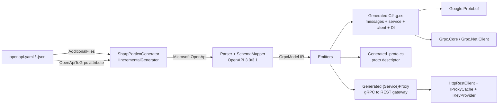

# SharpPortico

**Incremental Source Generator: OpenAPI 3.0/3.1 → gRPC + Protobuf + C# 14**

[](https://github.com/sponsors/MPCoreDeveloper)
[](https://www.nuget.org/packages/SharpPortico.SourceGenerator)
[](/CHANGELOG.md)

SharpPortico is a compile-time source generator that converts OpenAPI specifications (YAML or JSON) into production-quality gRPC services, protobuf messages, and modern C# 14 client/server code — zero reflection, NativeAOT-safe, fully AOT compatible. An optional **proxy mode** turns it into a gRPC↔REST gateway for legacy REST APIs.

Runs on **.NET 10 and .NET 11**. The generator itself is `netstandard2.0`, which is what Roslyn loads analyzers on, so it works in a consumer's compiler whatever that consumer targets; the generated code is emitted in C# 14 and compiles on both.


## Highlights

- 🚀 **`IIncrementalGenerator`** — fast incremental pipeline, safe on 10k-line specs
- 📦 **C# 14** output — primary constructors, collection expressions, required members, file-scoped namespaces
- 🧱 **NativeAOT / reflection-free** — hand-written `IMessage<T>` implementations, no `Activator`; `samples/NativeAotExample` is a 3.1 contract published as a native image and run in CI, so the claim is a binary that runs rather than a flag
- 🌐 **Both server and client, and both hosts** — the generated `ServiceBase` is served by `Grpc.Core` or by ASP.NET Core's `MapGrpcService`, alongside a modern typed client (`GrpcChannel`)
- 🔁 **Proxy mode** — generated `{Service}Proxy : ServiceBase` forwards gRPC → legacy REST (X-Api-Key outbound, response cache with per-call bypass, ULID client keys, audit logging)
- 🔐 **Auth mapped** — Bearer / API-Key / OAuth2 metadata helpers and interceptors
- 🧠 **Smart mapping** — `$ref`, `allOf`, `oneOf`/`anyOf`, arrays → `repeated`, enums, pagination detection, streaming hints (`x-grpc-streaming`), octet-stream → `bytes`
- 🛠️ **Two declaration styles** — `<AdditionalFiles>` and/or `[OpenApiToGrpc]` assembly attributes

## Architecture


```mermaid
flowchart LR
    A[openapi.yaml / .json] -->|AdditionalFiles| G[SharpPorticoGenerator<br/>IIncrementalGenerator]
    A -->|OpenApiToGrpc attribute| G
    G -->|Microsoft.OpenApi| P[Parser + SchemaMapper<br/>OpenAPI 3.0/3.1]
    P -->|GrpcModel IR| E[Emitters]
    E --> C[Generated C# .g.cs<br/>messages + service + client + DI]
    E --> PR[Generated .proto.cs<br/>proto descriptor]
    E --> PX["Generated {Service}Proxy<br/>gRPC to REST gateway"]
    C --> R[Google.Protobuf]
    C --> S[Grpc.Core / Grpc.Net.Client]
    PX --> H[HttpRestClient + IProxyCache + IKeyProvider]
```

## Mapping rules

| OpenAPI Concept | gRPC / Protobuf Mapping |
| --- | --- |
| paths + HTTP verb | Unary RPC by default; `x-grpc-streaming` or large POST payloads → streaming |
| path / query / header params | Combined into a single `*Request` message |
| request body | Nested message; `application/octet-stream` → `bytes` |
| response | `*Response` message + google.rpc.Status-shaped error wrapper |
| components/schemas | `message` definitions; `$ref`, `allOf`, `oneOf`/`anyOf` resolved |
| OpenAPI **3.1** — `type` arrays, `const`, `prefixItems`, `contentEncoding`, numeric exclusive bounds, `$defs`, `webhooks` | read through a 3.0 rewrite; each construct is mapped, and what it lost is reported (`SP1002`/`SP1003`) rather than passed over |
| arrays | `repeated` fields |
| enums | protobuf enums |
| authentication | metadata helpers + interceptors for Bearer / API-Key / OAuth2 |
| pagination | `page/limit/cursor/next_page_token` detected → token-based or server-streaming |

## Quick start

### 1. Declare the spec

**`OpenApiToGrpc` attribute** (assembly level):

```csharp
using SharpPortico;

[assembly: OpenApiToGrpc("openapi/users.yaml", "UserService", "MyApp.Generated")]
```

**or MSBuild `<AdditionalFiles>`:**

```xml
<ItemGroup>
  <AdditionalFiles Include="openapi/**/*.yaml" />
</ItemGroup>
```

### 2. Reference the generator

```xml
<ProjectReference Include="../../src/SharpPortico.SourceGenerator/SharpPortico.SourceGenerator.csproj"
                  ReferenceOutputAssembly="false"
                  OutputItemType="Analyzer" />
```

### 3. Use the generated code

```csharp
using var channel = GrpcChannel.ForAddress("http://localhost:50051");
var client = UserServiceClient.Create(channel);

var user = await client.GetUserAsync(42);
```

## Hosting the generated service

One service base, two hosts.

**ASP.NET Core (grpc-dotnet).** The base carries `[BindServiceMethod(typeof(PetService), "BindService")]` and the
contract carries the `BindService(ServiceBinderBase, PetServiceBase)` overload that grpc-dotnet's binder looks
for, so `MapGrpcService` finds the service:

```csharp
builder.Services.AddGrpc();
builder.Services.AddSingleton<PetServiceImpl>();

var app = builder.Build();
app.MapGrpcService<PetServiceImpl>();
```

**Grpc.Core.** Unchanged: `PetService.BindService(new PetServiceImpl())` returns the `ServerServiceDefinition`
that `Server` takes.

An implementation overrides `ListPetsAsync(request, context)` either way. grpc-dotnet binds a handler by the
RPC's own name, so the base also declares `ListPets(request, context)`, which forwards to `ListPetsAsync`.

> **NativeAOT:** the messages, the contract and the client are reflection-free, but grpc-dotnet's *server* binds
> by reflection — it looks up the binder method and each handler at startup — so an ASP.NET Core gRPC server is
> not an AOT target. That is a property of grpc-dotnet rather than of the generated code.
>
> The `Grpc.Core` host above is the AOT-safe server, which is what `samples/NativeAotExample` publishes: a native
> executable that serves the generated contract and drives the generated client from the same process.

## Proxy mode (gRPC clients → legacy REST)

Point local .NET apps at SharpPortico over gRPC while it forwards to a legacy REST service (X-Api-Key, corporate network). Host the generated `{Service}Proxy : ServiceBase`:

```csharp
[assembly: OpenApiToGrpc("openapi/users.yaml", "UserService", "MyApp.Generated",
    EnableProxyGeneration = true,
    ProxyBaseUrl = "https://corporate.example",
    ProxyApiKeyHeaderName = "X-Api-Key",
    ProxyCacheTtlSeconds = 60,
    ProxyClientKeyMode = ClientKeyMode.None,
    ProxyAuditEnabled = true)]
```

```csharp
var options = new ProxyOptions { BaseUrl = "https://corporate.example", ApiKeyHeaderName = "X-Api-Key" };
server.Services.Add(UserService.BindService(
    new UserServiceProxy(options, new HttpRestClient(httpClient, options.BaseUrl),
        cache: new MemoryProxyCache(memoryCache), keys: keyProvider)));
```

- **Cache**: GET responses are cached (TTL). Clients bypass per call via `x-portico-bypass-cache` metadata.
- **Client keys** (`ProxyClientKeyMode`): `None` · `Forward` (client key → X-Api-Key 1:1) · `Own` (validate ULID-shaped key `x-portico-key`, use configured outbound key).
- **Keys never hardcoded**: `IKeyProvider` (config / Key Vault / delegate).
- **Audit**: `ProxyAuditEnabled = true` (or inject `IProxyAuditLogger`) logs client, RPC, cache-hit, HTTP status.

Live end-to-end demo: `samples/LegacyProxyExample`. OpenAPI 3.1 + NativeAOT demo: `samples/NativeAotExample`. Full developer guide: `docs/SharpPortico.md`. NuGet package readmes: `src/SharpPortico.SourceGenerator/README.md`, `src/SharpPortico.Runtime/README.md`, `src/SharpPortico.Cli/README.md`.

## Repo layout

```
SharpPortico/
├── src/
│   ├── SharpPortico.SourceGenerator/   // Incremental generator
│   ├── SharpPortico.Abstractions/      // [OpenApiToGrpc] attribute + options
│   ├── SharpPortico.Runtime/           // AOT-safe runtime helpers (proxy pipeline; packed)
│   └── SharpPortico.Cli/               // dotnet sharpportico generate (tool)
├── samples/
│   ├── GrpcServerExample/              // full gRPC server + client (petstore)
│   ├── MinimalApiExample/              // ASP.NET Minimal API over the gRPC client
│   ├── LegacyProxyExample/             // gRPC→REST proxy: cache hit + bypass demo
│   └── NativeAotExample/               // OpenAPI 3.1 contract published as a native image (PublishAot)
├── tests/
│   └── SharpPortico.Tests/             // xunit snapshot + mapping + perf tests
├── docs/
└── .github/scripts/check-protos.sh     // compiles every sample's emitted descriptor with protoc
```

## CLI

```bash
dotnet tool install -g SharpPortico.Cli --version 1.3.0-preview.2

# What the mapping makes of the spec: service, namespace, package, RPC surface, counts, diagnostics
sharpportico generate openapi/petstore.yaml

# And the descriptor a build of it would ship
sharpportico generate openapi/petstore.yaml --out out/
```

The descriptor comes from the emitter the generator itself calls and is LF-normalized exactly as the generated
`{Service}Proto.Text` const holds it, so the file and a build of the same spec cannot disagree — which is what makes it
worth handing to `protoc`, to a client generator or to a reviewer. The C# compiler never reads that descriptor, so CI
compiles every sample's with `protoc` (`.github/scripts/check-protos.sh`): a name `protoc` rejects, or an import left
out of the file, is otherwise a build that stays green.

## JavaPortico

Looking for the Java equivalent? **[JavaPortico](https://github.com/MPCoreDeveloper/JavaPortico)** is the Java sibling of SharpPortico — the same OpenAPI → gRPC + protobuf generator and gRPC↔REST proxy pipeline for the Java/Maven ecosystem (JDK 25 LTS), with a matching mapping model, proxy runtime and configuration knobs.

## Changelog

See [CHANGELOG.md](CHANGELOG.md) for the full release history.

## License

MIT — see [LICENSE](LICENSE). Copyright (c) 2026 MPCoreDeveloper.